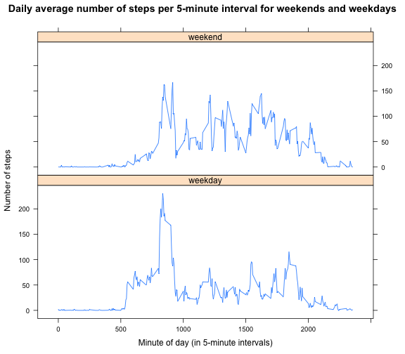

# Reproducible Research: Peer Assessment 1

In this first assignment for the course Reproducable Research we are taking [two months of data](https://d396qusza40orc.cloudfront.net/repdata%2Fdata%2Factivity.zip) on the stepping behaviour of a single test subject and producing summary statistics and figures.

## Loading and preprocessing the data

Loading of the data with the following code assumes you have a copy of the datafile "activity.zip" (obtained from the above link) in your current working directory. The lubridate package is used to convert the dates into date objects in R (i.e., POSIXct).


```r
library(lubridate)
d <- read.csv(unzip("activity.zip"))
d$date <- ymd(d$date)
str(d)  # Have a quick look at the data
```

```
## 'data.frame':	17568 obs. of  3 variables:
##  $ steps   : int  NA NA NA NA NA NA NA NA NA NA ...
##  $ date    : POSIXct, format: "2012-10-01" "2012-10-01" ...
##  $ interval: int  0 5 10 15 20 25 30 35 40 45 ...
```

## What is mean total number of steps taken per day?

The following is a histogram of the total number of steps our subject took each day during the three months he/she was monitored.


```r
# Split the dataframe up by day for further summaries:
stepsByDay <- sapply(split(d$steps, d$date), sum, na.rm = T)
hist(stepsByDay, xlab = "Number of steps per day", main = "Histogram of the total number of steps taken per day")
```

 

```r
meanSteps <- round(mean(stepsByDay, na.rm = T))
medianSteps <- median(stepsByDay, na.rm = T)
```

The mean and meadian total number of steps taken per day were 9354 and 10395, respectively.

## What is the average daily activity pattern?

The following plot displays the average number of steps taken during each 5-minute interval (x-axis), averaged across all days (y-axis). In other words, it is a visualization of the pattern of steps taken during a 'typical' day. 


```r
# Split the dataframe up by 5-minute intervals for further summaries:
stepsByInterval <- sapply(split(d$steps, d$interval), mean, na.rm = T)
plot(names(stepsByInterval), stepsByInterval, type = "l", xlab = "Minute of day (in 5-minute intervals)", 
    ylab = "Number of steps", main = "Daily average number of steps per 5-minute interval")
```

 

```r
maxSteps <- round(max(stepsByInterval))
maxIntervalIndex <- which(stepsByInterval == max(stepsByInterval))
maxIntervalName <- names(which(stepsByInterval == max(stepsByInterval)))
```

The 104th 5-minute interval (i.e. that which starts at the 835th minute of the day) contains the maximum number of steps (which was 206) on average across all the days in the dataset.

## Imputing missing values

There were several missing values (NAs) in the dataset, including entire days. I decided to replace these values with the mean calculated for the same 5-minute interval over all the days where a value was recorded.


```r
numNA <- sum(is.na(d[, 1]))
# Replace NAs with the average number of steps for that 5-minute interval
d[is.na(d$steps), "steps"] <- stepsByInterval[match(d[is.na(d$steps), "interval"], 
    names(stepsByInterval))]
# Write the cleaned data to a new dataframe
dClean <- d
# Split the dataframe up by day for further summaries:
stepsByDayClean <- sapply(split(dClean$steps, dClean$date), sum, na.rm = T)
hist(stepsByDayClean, xlab = "Number of steps per day", main = "Histogram of the total number of steps taken per day")
```

 

```r
meanStepsClean <- as.integer(round(mean(stepsByDayClean, na.rm = T)))
medianStepsClean <- as.integer(round(median(stepsByDayClean, na.rm = T)))
```

After replacing NA values with their mean, the mean and median total number of steps taken per day were 10766 and 10766, respectively.

By replacing missing values with calculated means we saw both the mean and median number of steps per day increase from the first part of this assignment and the data became more 'normal' by inspection of the histogram. This makes some sense as missing values, which would have tendend to produce low daily averages, were replaced by the mean itself and therefore strengthen central tendancy. Thus the impact of adding these calculated values was to increase the estimated mean number of steps per day, make the mean and median become equal (as many days ended up adopting the mean value), and to normalize the data.

## Are there differences in activity patterns between weekdays and weekends?

To determine if stepping patterns were different on weekdays versus weekends I first needed to create a new variable ("weekday") based on whether or not our time varialble (date) indicate weekday or weekend. This was trivial since i had already converted "date" to a POSIXct object. I then used the "aggregate" function to reshape the data in order to prepare them for plotting. Finally I produced a 2-panel figure for the subject's stepping patterns over averaged weekdays and weekends. The results suggest that the subject does behave differently on weekdays versus weekends. In general, the subject appears to take more steps earlier on weekdays, whereas on weekends the activity pattern is more spread out across the day.


```r
library(lattice)
dClean$weekday <- ifelse(weekdays(dClean$date) %in% c("Saturday", "Sunday"), "weekend", 
    "weekday")
# Split the dataframe up by 5-minute intervals for further summaries by weekday:
dCleanSplit <- aggregate(dClean, by = dClean[, c("interval", "weekday")], mean, simplify = F)
xyplot(steps ~ interval | weekday, dCleanSplit, type = "l", layout = c(1, 2), xlab = "Minute of day (in 5-minute intervals)", 
    ylab = "Number of steps", main = "Daily average number of steps per 5-minute interval for weekends and weekdays")
```

 
